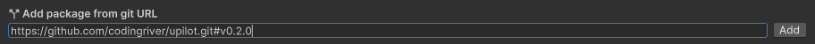
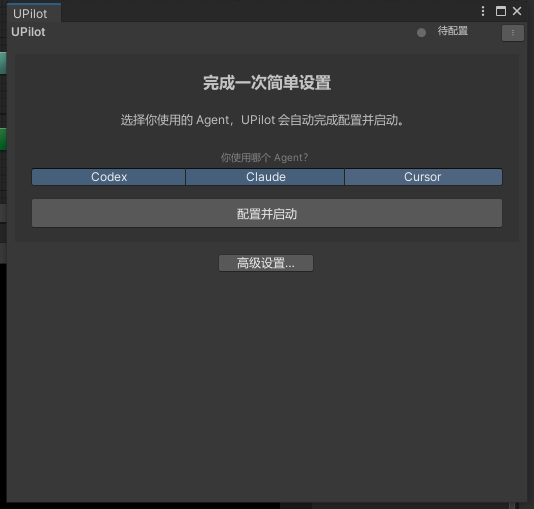
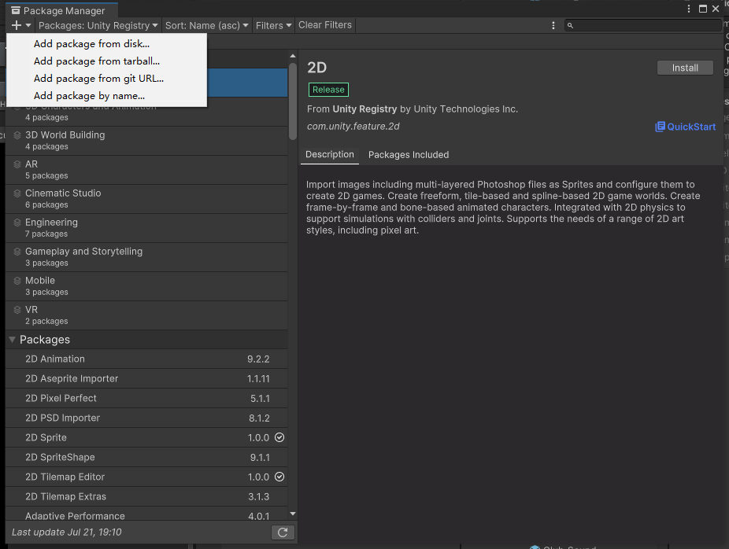
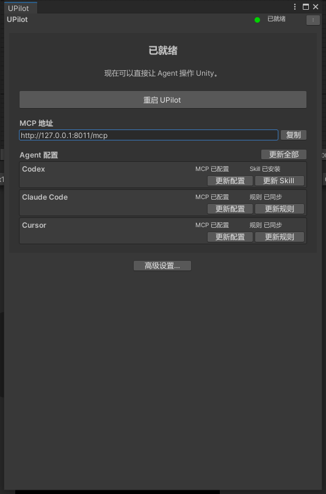
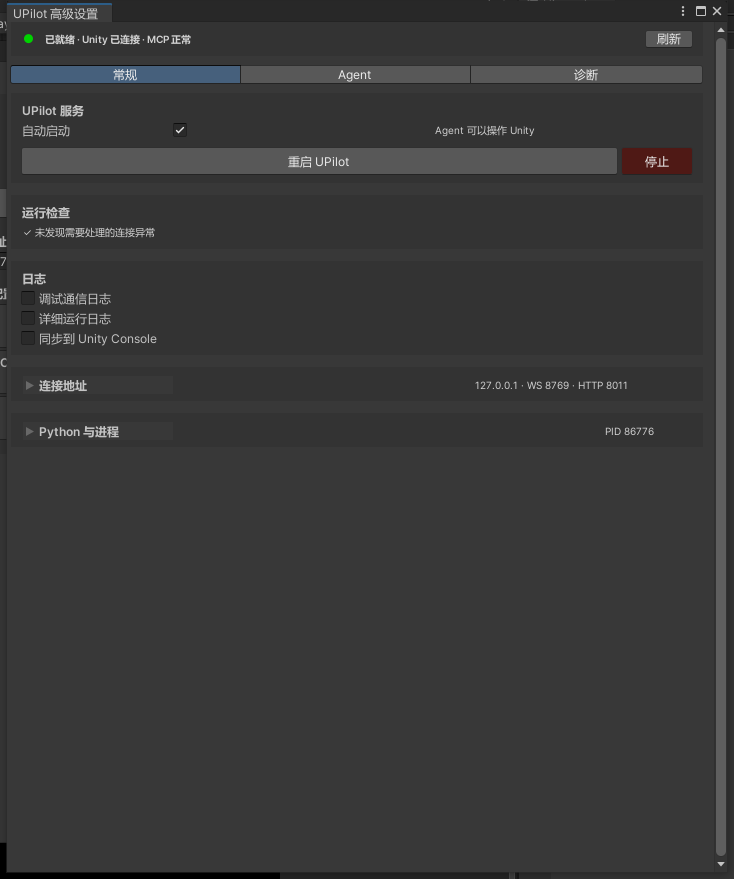

# UPilot

让 Codex、Claude Code、Cursor 等 AI Agent 直接操作 Unity Editor。

UPilot 会在 Unity 中启动本地 MCP 服务，并为常见 Agent 自动写入项目级连接配置。配置完成后，你可以直接让 Agent 查看场景、检查编译错误、读取 Console、修改 GameObject、管理资源、运行测试或构建任务。

> 当前版本：`0.2.0`
>
> Unity：`2022.3` 或更高
>
> Python：`3.11` 或更高
>
> 默认 MCP 地址：`http://127.0.0.1:8011/mcp`

> 教程截图来自 Windows 上的 Unity 2022.3。不同 Unity 版本、操作系统或编辑器主题下，界面外观可能略有差异，但按钮名称和操作流程一致。

## 5 分钟快速上手

### 1. 确认环境

在终端中确认已安装 Python 3.11 或更高版本：

```powershell
python --version
```

如果系统提示找不到 `python`，请先安装 [Python](https://www.python.org/downloads/)，安装时勾选 **Add Python to PATH**。

### 2. 安装 Unity 包

在 Unity 中打开：

```text
Window > Package Manager
```

点击左上角 `+`，选择 **Add package from git URL...**，输入：

```text
https://github.com/codingriver/upilot.git#v0.2.0
```

点击 **Add**，等待 Unity 完成包导入和脚本编译。



*输入 UPilot Git URL 后点击右侧 Add。*

### 3. 安装 Python 依赖

在 PowerShell 或终端中执行：

```powershell
python -m pip install "git+https://github.com/codingriver/upilot.git@v0.2.0#subdirectory=upilotserver~"
```

如果你已经下载或克隆了 UPilot 仓库，也可以在仓库中执行：

```powershell
cd upilotserver~
python -m pip install -e .
```

### 4. 在 Unity 中配置并启动

包导入完成后，Unity 会自动打开 UPilot 设置界面。如果没有自动打开，请选择：

```text
UPilot > UPilot
```

然后：

1. 选择你正在使用的 Agent：`Codex`、`Claude` 或 `Cursor`，支持多选。
2. 点击 **配置并启动**。
3. 等待界面显示 **已就绪**。



*选择常用 Agent 后点击“配置并启动”。*

UPilot 会自动选择可用端口、写入所选 Agent 的 MCP 配置，并同步所需的 Skill/规则。

### 5. 重启 Agent 并验证

首次写入配置后，请重新启动 Agent 客户端，或重新加载当前项目窗口，使 MCP 工具列表刷新。

然后对 Agent 说：

```text
请调用 unity_mcp_status，确认 UPilot 已连接，并检查当前 Unity 工程路径。
```

成功时应满足：

- `connected: true`
- `serverReady: true`
- 返回的 Unity 工程路径与当前项目一致

现在可以开始使用 UPilot。

## 环境要求

| 项目 | 要求 |
|---|---|
| Unity | 2022.3 或更高版本 |
| Python | 3.11 或更高版本 |
| Agent | Codex、Claude Code、Cursor，或支持 Streamable HTTP MCP 的客户端 |
| 网络 | 首次通过 Git 和 pip 安装时需要访问 GitHub 与 Python 包源 |

UPilot 默认只监听本机地址 `127.0.0.1`。Unity Editor 必须保持打开，Agent 才能操作当前项目。

## 完整安装教程

### 方式一：通过 Unity Package Manager 安装（推荐）

1. 打开 Unity 项目。
2. 选择 `Window > Package Manager`。
3. 点击左上角 `+`。
4. 选择 **Add package from git URL...**。
5. 输入以下地址并点击 **Add**：



*点击左上角加号，然后选择“Add package from git URL...”。*

```text
https://github.com/codingriver/upilot.git#v0.2.0
```

安装完成后，Package Manager 中应显示包名 **UPilot**，包标识为：

```text
io.github.codingriver.upilot
```

### 方式二：手动修改 manifest.json

如果 Package Manager 无法添加 Git URL，可以打开 Unity 项目的 `Packages/manifest.json`，在 `dependencies` 中加入：

```json
{
  "dependencies": {
    "io.github.codingriver.upilot": "https://github.com/codingriver/upilot.git#v0.2.0"
  }
}
```

如果文件中已有其他依赖，请只增加这一项，并注意上一项末尾的逗号。保存后返回 Unity，等待包解析和脚本编译完成。

### 安装 Python 服务依赖

Unity 包内已经包含 UPilot 服务启动脚本，但运行它仍需要 Python 依赖。推荐直接安装与 Unity 包相同版本的 Python 包：

```powershell
python -m pip install "git+https://github.com/codingriver/upilot.git@v0.2.0#subdirectory=upilotserver~"
```

安装完成后可以执行以下命令进行检查：

```powershell
python -c "import mcp, websockets, yaml, PIL; print('UPilot Python dependencies OK')"
```

看到 `UPilot Python dependencies OK` 即表示依赖可用。

如果电脑安装了多个 Python，请确保执行安装命令的 Python 版本为 3.11 或更高，并且可以从系统 PATH 中找到。

## 首次配置教程

### 使用简化设置（推荐）

首次导入 UPilot 后，主界面会提示“完成一次简单设置”。

1. 选择常用 Agent。
2. 点击 **配置并启动**。
3. 等待状态从“正在启动”变为“已就绪”。


*Codex、Claude 和 Cursor 可以单选或多选。*

选择多个 Agent 时，UPilot 会同时写入这些 Agent 的项目级 MCP 配置。之后也可以在主界面的 **Agent 配置** 区域单独添加其他 Agent。

### 配置过程中会发生什么

UPilot 会自动处理以下内容：

- 为当前 Unity 项目选择可用的本地端口。
- 启动 Unity Bridge 和 MCP 服务。
- 写入所选 Agent 的项目级 MCP 连接。
- 写入或更新 UPilot 管理的 Agent 规则。
- 为 Codex 同步 UPilot Skill。

已有配置文件中的其他 MCP 服务和用户内容会尽量保留。UPilot 管理的内容使用独立标记或独立配置项进行更新。

### MCP 地址

默认地址是：

```text
http://127.0.0.1:8011/mcp
```

实际地址会显示在 UPilot 主界面的 **MCP 地址** 区域，点击 **复制** 即可复制。

> 请始终使用界面显示的实际地址。多项目或端口冲突时，UPilot 可能会选择其他 HTTP 端口。

不要把 Unity Bridge 的 WebSocket 地址配置给 Agent。WebSocket 仅供 UPilot 内部连接使用。

## Codex、Claude Code 与 Cursor

推荐通过 Unity 的 UPilot 界面自动配置。以下内容仅用于检查配置或自动配置不可用时手动处理。

### Codex

项目配置文件：

```text
.codex/config.toml
```

配置内容：

```toml
[mcp_servers.upilot]
url = "http://127.0.0.1:8011/mcp"
startup_timeout_sec = 10
tool_timeout_sec = 300
```

Codex 还会使用项目中的 `AGENTS.md` 和 `.agents/skills/upilot-unity-mcp`。因此，除了 MCP 配置外，建议同时在 UPilot 界面更新 **Skill**。

### Claude Code

项目配置文件：

```text
.mcp.json
```

配置内容：

```json
{
  "mcpServers": {
    "upilot": {
      "type": "http",
      "url": "http://127.0.0.1:8011/mcp"
    }
  }
}
```

Claude Code 的 UPilot 使用规则会同步到项目规则文件中。

### Cursor

项目配置文件：

```text
.cursor/mcp.json
```

配置内容：

```json
{
  "mcpServers": {
    "upilot": {
      "url": "http://127.0.0.1:8011/mcp"
    }
  }
}
```

Cursor 的 UPilot 规则位于：

```text
.cursor/rules/upilot-unity-mcp.mdc
```

手动修改配置后，请重启或刷新 Agent 客户端。

## 如何确认安装成功

### 在 Unity 中确认

打开 `UPilot > UPilot`，检查：

- 顶部状态为 **已就绪**。
- 主界面显示 MCP 地址。
- 常用 Agent 显示 **MCP 已配置**。
- Codex 显示 Skill 状态，Claude Code 和 Cursor 显示规则状态。

### 在浏览器中检查服务

打开：

```text
http://127.0.0.1:8011/health
```

如果 UPilot 使用了其他端口，请把 `8011` 替换成主界面显示的端口。

直接用浏览器打开 `/mcp` 可能返回 `406 Not Acceptable`，这是正常现象，因为 `/mcp` 是 MCP 通信端点，不是普通网页。健康检查应使用 `/health`。

### 在 Agent 中确认

发送：

```text
请调用 unity_mcp_status，并告诉我：
1. connected 和 serverReady 是否为 true；
2. 当前连接的 Unity 工程路径；
3. Unity 是否正在编译或进入 Play Mode。
```

如果返回的工程路径不是你正在处理的项目，请先停止操作，切换到正确的 MCP 地址后再继续。

## 第一次使用 UPilot

建议先从只读任务开始，确认连接和项目识别都正确。

### 查看项目与场景

```text
请使用 UPilot 检查当前 Unity 项目、已打开场景和场景层级，只做分析，不修改任何内容。
```

### 检查编译错误

```text
请使用 UPilot 检查当前 Unity 编译状态和编译错误，说明错误原因，暂时不要修改代码。
```

### 检查 Console

```text
请使用 UPilot 读取最近的 Unity Console Error 和 Warning，并按优先级汇总。
```

### 修改场景对象

```text
请使用 UPilot 在当前场景创建一个名为 TestRoot 的空 GameObject，创建前先确认当前场景，完成后再次读取对象验证结果。
```

### 修复代码并编译

```text
请分析当前编译错误，修复相关 C# 代码，然后让 Unity 同步并编译，最后确认没有新的编译错误。
```

### 运行测试或长任务

```text
请使用 UPilot 运行项目的 EditMode 测试，持续查询任务状态，直到成功、失败或取消，并汇总最终结果。
```

对于测试、构建和其他异步任务，仅“开始执行”不代表完成。应要求 Agent 持续查询，直到得到最终结果。

## 主界面说明

通过 `UPilot > UPilot` 打开主界面。



*主界面集中显示服务状态、MCP 地址以及各 Agent 的配置状态。*

### 服务状态

- **已就绪**：可以直接让 Agent 操作 Unity。
- **正在启动/正在重启**：等待几秒钟，不需要重复点击。
- **需要修复**：点击 **自动修复**，UPilot 会尝试修复服务路径、端口或连接。
- **已停止**：点击 **启动 UPilot**。

### 重启 UPilot

服务已就绪时，点击 **重启 UPilot**。重启会同时重建 MCP 服务和 Unity 连接，常用于：

- Agent 突然无法调用工具。
- Unity 重新加载脚本后连接未恢复。
- 修改端口或服务设置后重新连接。
- MCP 工具调用持续超时。

重启 UPilot 后，如果 Agent 的工具列表仍未刷新，再重启或重新加载 Agent 客户端。

### Agent 配置

主界面会列出 Codex、Claude Code 和 Cursor，并分别显示 MCP 与 Skill/规则状态。

- **配置**：当前 Agent 还没有 UPilot MCP 配置，点击后新增配置。
- **更新配置**：当前 Agent 已有 UPilot 配置。点击后会二次确认，只更新该 Agent 的 UPilot MCP 配置项。
- **更新 Skill**：为 Codex 更新 UPilot Skill。
- **更新规则**：为 Claude Code 或 Cursor 更新 UPilot 规则。
- **更新全部**：更新已有的 UPilot MCP 连接条目，并重新同步全部 UPilot Skill/AGENT 规则。

“更新全部”不会为尚未配置 MCP 的 Agent 自动新增连接。如果之后开始使用新的 Agent，请在对应一行点击 **配置**。

如果 Skill/规则包含本地修改，强制更新可能覆盖 UPilot 管理的内容。确认前请先保存需要保留的自定义内容。

## 高级设置、停止与诊断

普通使用不需要进入高级设置。需要停止服务、修改端口或查看详细诊断时，点击主界面的 **高级设置…**，或选择：

```text
UPilot > Advanced Settings
```



*高级设置提供运行检查、重启、红色停止按钮、端口、Python 和诊断功能。*

### 停止 UPilot

停止按钮只在高级设置中提供，并以红色显示。点击 **停止** 后还需要二次确认。

停止后，Agent 将暂时无法操作 Unity。界面会显示“正在停止”或“已停止”，需要恢复时点击 **启动 UPilot**。

### 高级设置可以做什么

- 查看 Unity Bridge、MCP 服务和 Agent 连接状态。
- 启动、重启或停止 UPilot。
- 开启或关闭自动启动。
- 修改 HTTP 和内部 WS 端口。
- 检查或修复 Python 启动入口。
- 查看操作日志、通信日志和完整诊断结果。
- 在普通停止无效时清理残留的 UPilot Python 进程。

结束所有疑似 MCP 服务进程属于故障恢复操作，只应在普通停止无效、端口持续被占用时使用。

## 同时打开多个 Unity 项目

每个 Unity 项目必须使用不同的 HTTP 和内部 WS 端口。

UPilot 首次配置或自动修复时会优先寻找空闲端口。多项目同时运行时：

1. 分别打开每个项目的 `UPilot > UPilot`。
2. 确认每个项目显示的 MCP 地址不同。
3. 在每个项目中更新对应 Agent 配置。
4. 在 Agent 中调用 `unity_mcp_status`，核对 Unity 工程路径。

不要仅根据端口判断项目，实际操作前始终核对 `unityProjectAbsolute` 返回的工程路径。

## 更新 UPilot

### 更新 Unity 包

使用固定版本 Git URL 时，把 `Packages/manifest.json` 中的版本标签改为目标版本，例如：

```text
https://github.com/codingriver/upilot.git#v0.2.0
```

保存后等待 Unity 完成包更新和脚本编译。

### 更新 Python 包

将命令中的版本改为与 Unity 包一致：

```powershell
python -m pip install --upgrade "git+https://github.com/codingriver/upilot.git@v0.2.0#subdirectory=upilotserver~"
```

### 同步 Agent 配置

更新完成后：

1. 打开 `UPilot > UPilot`。
2. 点击 **更新全部**。
3. 确认提示“将更新已有的 UPilot MCP 连接条目，重新同步全部 UPilot Skill/AGENT规则”。
4. 重启 UPilot。
5. 重启或刷新 Agent 客户端。
6. 再次调用 `unity_mcp_status` 验证连接和项目路径。

## 常见问题

### Unity 中没有出现 UPilot 菜单

1. 在 Package Manager 中确认 `io.github.codingriver.upilot` 已安装。
2. 等待 Unity 完成脚本编译。
3. 检查 Console 是否有其他 C# 编译错误；项目中任何编译错误都可能阻止 Editor 菜单加载。
4. 关闭并重新打开 Unity 项目。

### 点击“配置并启动”后一直停留在启动中

1. 确认 `python --version` 为 3.11 或更高。
2. 重新执行 Python 依赖安装命令。
3. 点击 **自动修复**。
4. 仍未恢复时打开 **高级设置**，检查 Python 入口、HTTP/WS 端口和诊断日志。

### 提示找不到 Python

安装 Python 3.11 或更高版本，并确保 Python 已加入 PATH。重新打开 Unity 后再次启动 UPilot。

Windows 可以执行：

```powershell
where.exe python
python --version
```

macOS 或 Linux 可以执行：

```bash
which python3
python3 --version
```

### Agent 看不到 UPilot 工具

1. 确认 Unity 中 UPilot 显示 **已就绪**。
2. 确认 Agent 对应行显示 MCP 已配置。
3. 复制主界面的 MCP 地址，确认配置文件中的 URL 一致。
4. 重启或刷新 Agent 客户端，使工具列表重新加载。
5. 让 Agent 调用 `unity_mcp_status`；如果该工具也不可见，说明客户端尚未加载 UPilot MCP 配置。

### 健康检查正常，但 Agent 仍然无法操作 Unity

健康检查正常只表示 HTTP 服务可访问，不代表 Unity 已完成连接。请在 Agent 中调用 `unity_mcp_status`，确认：

- `connected` 为 `true`
- `serverReady` 为 `true`
- 工程路径正确

### Agent 连接到了错误的 Unity 项目

停止当前操作，打开目标项目的 UPilot 主界面，复制它显示的 MCP 地址，然后更新当前 Agent 配置。重启 Agent 后再次检查工程路径。

### 端口被占用

在主界面点击 **自动修复**。UPilot 会尝试选择空闲端口并重新启动。端口变化后，还需要更新 Agent 配置并刷新 Agent 客户端。

### 修改了 Skill/规则，更新时提示会覆盖

UPilot 会保护普通项目内容，但强制更新会覆盖 UPilot 管理的 Skill/规则内容。请先备份本地自定义内容，再确认更新。

### 浏览器访问 /mcp 返回 406

这是正常现象。`/mcp` 只用于 MCP 客户端通信，浏览器检查请访问：

```text
http://127.0.0.1:8011/health
```

## 卸载

1. 在 `UPilot > Advanced Settings` 中点击红色 **停止**，并确认停止。
2. 在 Unity Package Manager 中选择 **UPilot**，点击 **Remove**。
3. 如不再使用 Python 服务，可执行：

```powershell
python -m pip uninstall upilot-mcp
```

4. 如需彻底清理项目配置，请只删除各配置文件中的 `upilot` MCP 项，不要直接删除包含其他服务的整个配置文件。
5. 可选清理 UPilot 管理的规则和 Skill：

```text
.agents/skills/upilot-unity-mcp
.cursor/rules/upilot-unity-mcp.mdc
```

`AGENTS.md`、`CLAUDE.md` 等文件可能包含项目自己的规则。清理时只移除 `<!-- upilot:start -->` 与 `<!-- upilot:end -->` 之间的 UPilot 管理块。

## UPilot Flow

UPilot Flow 是可选的 Unity Editor 界面自动化功能，普通用户不需要启用。

- 默认关闭，不影响 UPilot 核心功能。
- 仅支持 Unity 6 或更高版本。
- 适合需要通过 YAML 编排复杂 EditorWindow 操作的高级场景。

需要使用时请查看 [UPilot Flow 文档](Documentation~/UPilot-Flow.md)。

## 使用建议

- 第一次连接先执行只读检查，再进行场景或资源修改。
- 让 Agent 在修改前确认目标场景、对象或资源。
- 对删除、覆盖、批量修改、构建发布等操作明确要求二次确认。
- 使用版本控制，并在重要操作前保存 Unity 场景和项目改动。
- 同时打开多个 Unity 项目时，每次操作前检查连接的工程路径。

## 获取帮助

- 项目主页：[https://github.com/codingriver/upilot](https://github.com/codingriver/upilot)
- 版本记录：[CHANGELOG.md](CHANGELOG.md)
- 问题反馈：[GitHub Issues](https://github.com/codingriver/upilot/issues)
- License：[MIT](LICENSE.md)
