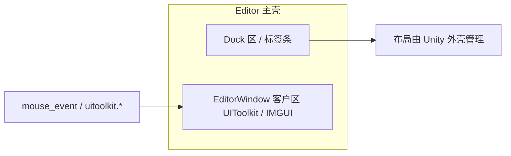

# UIToolkit / 编辑器工具 — Agent 通过 MCP 验收操作指南

本文说明：**如何用已有 MCP 工具与 E2E 规格**对「编辑器窗口 + UIToolkit」做自动化验收（点击、滚动、输入、拖放等），便于 Agent 在开发完成后自检。

## 1. 推荐工作流

1. **连通 Unity**：`unity_mcp_status` / `unity_ensure_ready`。
2. **打开被测窗口**：`unity_menu_execute(menuPath)` 或工程内自定义菜单。
3. **主线程等待布局**：`unity_editor_delay(delayMs)` 或 E2E 里 `action: wait`（默认走编辑器主线程延迟）。
4. **探针 UI**：`unity_uitoolkit_dump` / `unity_uitoolkit_query` 确认 `name`、控件类型；**给可交互控件设置稳定 `name`** 便于自动化。
5. **操作**：下表工具；复杂流程用 **`unity_editor_e2e_run(specPath=...)`** 跑 YAML 批步骤。
6. **断言**：`uitoolkit.query` / `console` / `screenshot`（见 M26 开发方案）；失败时目录下已有 `report.json` 与附件。

## 2. 操作意图 → MCP 工具（直接调用）

| 意图 | MCP 工具 | 要点 |
|------|-----------|------|
| 按钮 / 可点击区域 | `unity_uitoolkit_interact` | `action`：`click`（默认）/`focus`/`blur`；用 `elementName` 或 `elementIndex` 定位 |
| **ScrollView 滚动（改 scrollOffset）** | `unity_uitoolkit_scroll` | `mode`：`absolute` 时 `scrollToX`/`scrollToY`（≥0 生效）；`delta` 时用 `deltaX`/`deltaY` 累加 `scrollOffset` |
| **滚动条滑块拖拽（thumb）** | `unity_uitoolkit_scrollbar_drag` | 与「改 scrollOffset」不同：模拟拖动 **Scrollbar** 的 thumb；需 `scrollViewElementName`（ScrollView 的 `name`） |
| 文本框 / Toggle / Slider 等赋值 | `unity_uitoolkit_set_value` | 支持 TextField、Toggle、Slider、Dropdown 等（见工具描述） |
| 原始合成事件（精细） | `unity_uitoolkit_event` | `eventType`：`click` / `keydown` / `keyup` / `mousedown` / `mouseup` / `focus` / `blur` / **`wheel`**；`wheel` 时传 `wheelDeltaX`/`wheelDeltaY`；可配 `mouseX`/`mouseY` |
| 键盘 | `unity_keyboard_event` | 窗口有 UIToolkit 时桥接会优先走合成事件 |
| 鼠标（坐标或按元素） | `unity_mouse_event` | 可配 `elementName`/`elementIndex` 自动算坐标 |
| **编辑器拖放（跨窗口 / DragAndDrop）** | `unity_drag_drop` | `sourceWindow` / `targetWindow` / `dragType` / 起止坐标；适用于 Project/Hierarchy 等 IMGUI+DragAndDrop |
| 等待元素出现/文案 | `unity_wait_condition` | `conditionType`：`element_exists` / `text_contains` 等 |

### ScrollView 参数说明（`unity_uitoolkit_scroll`）

- 定位 ScrollView：**优先**设 `elementName`（与 UXML `name` 一致）；否则 `elementIndex`（窗口内第 N 个 `ScrollView`）；都不设则取**第一个** `ScrollView`。
- **`mode=absolute`**：`scrollToX`/`scrollToY` 为 **-1** 表示不修改该轴。
- **`mode=delta`**：在当前 `scrollOffset` 上加上 `deltaX`/`deltaY`。
- 多步滚动：多次调用 `mode=delta` 或分步 `absolute`，中间可加 `unity_editor_delay`。

### scrollOffset（`uitoolkit.scroll`）与滚动条拖拽（`uitoolkit.scrollbar.drag`）

- **`unity_uitoolkit_scroll`**：直接读写 `ScrollView` 的 **`scrollOffset`**，适合列表/区域快速定位、程序化滚动。
- **`unity_uitoolkit_scrollbar_drag`**：在 **Scrollbar** 上合成按下—移动—抬起，模拟用户拖 **thumb**；适用于依赖拖拽路径或滚动条交互逻辑的 UI（与单纯改 `scrollOffset` 不等价）。

### 嵌套 ScrollView（BL-07）

- **问题**：`elementName` 只匹配树上**第一个**该 `name` 的 `ScrollView`，可能滚到外层。
- **做法**：使用 **`scrollViewNamePath`**（`outer-name|inner-name`，也可用 `/` 分隔），从外到内依次 `Q<ScrollView>` 定位内层，再滚动/拖拽。
- **示例**：`unity_uitoolkit_scroll(..., scrollViewNamePath="outer-sv|inner-sv", mode=delta, deltaY=40)`；E2E 中同字段名。

### 客户区 vs 停靠壳（BL-08）

- **客户区内**：用 `uitoolkit.*`、`mouse_event`（映射到窗口内坐标）操作。
- **拖动停靠条、改 Workspace、保存布局**：不保证 Bridge 覆盖；见 M27 需求「非目标」与 OS 级自动化。

### `editor.window.setRect` 与多显示器 / DPI（BL-09）

- 矩形使用 Unity `EditorWindow.position`（与 `editor.windows.list` 一致），单位为 **编辑器坐标系下的点**；**多显示器** 时 `x/y` 可能超出单屏范围。
- **DPI 缩放**（125% / 150%）下，与 OS 像素坐标可能不一致；验收以「读回 `editor.windows.list` 与设定一致」为准。

### 指针捕获（BL-16 补充）

- **`uitoolkit.event`**：`eventType=capturePointer` / `releasePointer`，在目标元素上调用 `CapturePointer` / `ReleasePointer`；**`mouseButton` 字段传 `pointerId`**（鼠标主键一般为 `0`）。用于需显式捕获的拖拽链；与 `pointerSequence` 可组合。

### 按钮点击

- 首选：`unity_uitoolkit_interact(targetWindow=..., elementName="my-button")`。
- 备用：`unity_uitoolkit_event(eventType="click", elementName=...)`。

## 3. E2E 规格（`unity_editor_e2e_run`）中的 `action` 名

规格文件路径由 **`specPath`** 指向磁盘上的 YAML（见 `e2e-specs/examples/`）。

| 意图 | YAML `action` 字段 | 备注 |
|------|-------------------|------|
| 点击等 | `uitoolkit.interact` | 使用 **`interactAction`**：`click` / `focus` / `blur`（避免与顶层 `action` 键冲突） |
| ScrollView | `uitoolkit.scroll` | `mode`、`deltaX`/`deltaY` 或 `scrollToX`/`scrollToY` |
| 滚动条滑块拖拽 | `uitoolkit.scrollbar.drag` | `scrollViewElementName`、`scrollbarAxis`、`normalizedThumbPosition`、`dragSteps` |
| 赋值 | `uitoolkit.setValue` | `value` + `elementName` |
| 合成事件 | `uitoolkit.event` | `eventType` 等；`wheel` 时 `wheelDeltaX`/`wheelDeltaY` |
| 指针序列（展开） | `uitoolkit.pointerSequence` | Runner 展开为多条 `uitoolkit.event` |
| 关窗 / 设窗口矩形 | `editor.window.close` / `editor.window.setRect` | 与 MCP 窗口工具一致 |
| 主线程等待 | `wait` 或 `editor.delay` | `wait` 默认 `unity: true` 走 `editor.delay` |
| 拖放 | `drag_drop` | 与 facade 参数一致 |

**defaults**：可在规格顶层设 `defaults.targetWindow`，子步骤省略重复窗口标题。

## 4. Agent 实施要点

1. **稳定选择器**：在 UXML 为按钮、ScrollView、列表项根节点设置 **`name`**，断言用 `uitoolkit.query` 的 `nameFilter`/`textFilter`。
2. **异步布局**：滚动/打开面板后增加 **`wait`（200–800ms）** 或 `unity_wait_condition`。
3. **拖放**：UIToolkit **内部**列表拖拽若 `DragAndDrop` 不适用，可尝试 **`uitoolkit.event` 连续 `mousedown` → `mousemove` → `mouseup`**（需在桥接能力范围内试验）；跨窗口资源拖放优先用 **`unity_drag_drop`**。
4. **整体验收**：将固定步骤写入 **`e2e-specs/examples/*.yaml`**，通过 **`unity_editor_e2e_run`** 一键回归。

## 5. 相关文档与示例

- 总览：`docs/M26-编辑器E2E自动化测试-开发方案.md`
- 示例规格：`e2e-specs/examples/uitoolkit_scroll_click_example.yaml`（滚动 + 点击 + 断言）
